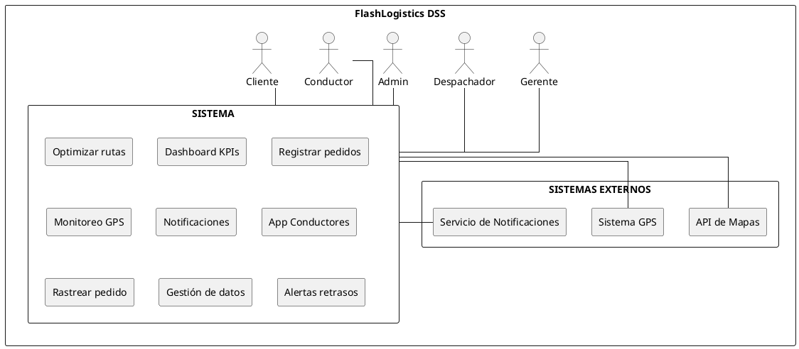
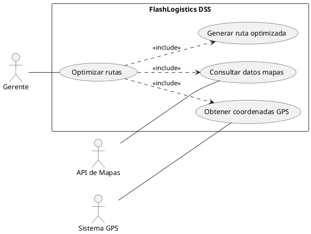
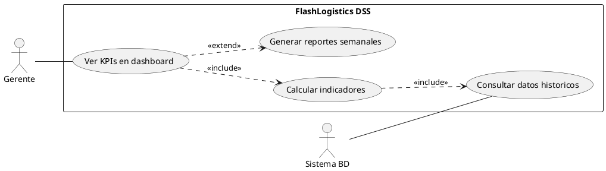
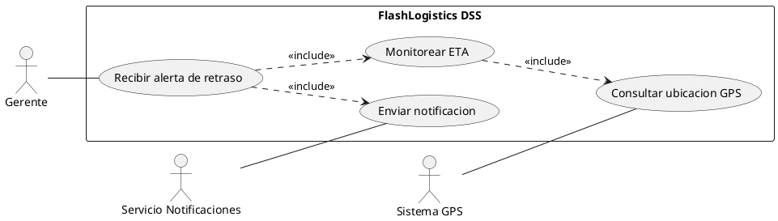
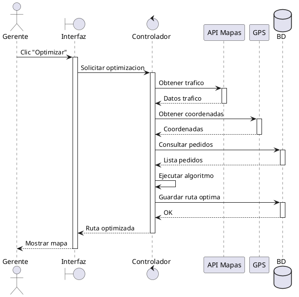
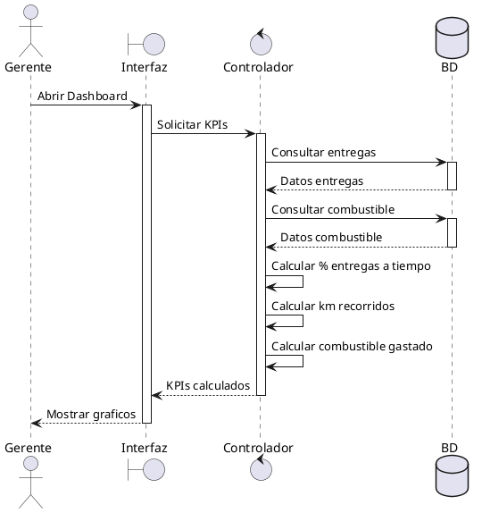
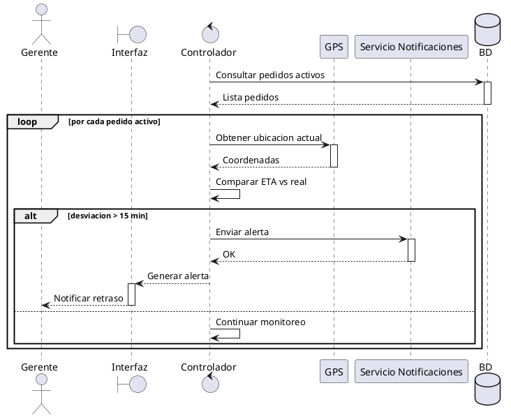

# FlashLogistics DSS

Sistema de apoyo a la toma de decisiones (DSS) para optimización de rutas de distribución y trazabilidad en tiempo real de flotas.

**Repositorio:** https://github.com/saaay13/flashlogistics-pbb
**GitHub Project (Kanban):** https://github.com/users/saaay13/projects/10/views/1

## Épicas

| ID | Nombre | Descripción |
|----|--------|-------------|
| EP01 | Gestión de Datos | Administración de pedidos, flota y conductores |
| EP02 | Motor de Rutas | Algoritmo de optimización y cálculo de costos |
| EP03 | Monitoreo GPS | Seguimiento en tiempo real y geolocalización |
| EP04 | Dashboard y Reportes | Indicadores clave y toma de decisiones |
| EP05 | Notificaciones | Alertas automáticas a clientes y despachadores |
| EP06 | App Conductores | Aplicación móvil para el equipo de reparto |

## Product Backlog

13 Historias de Usuario priorizadas en GitHub Projects.

## Formulario de Refinamiento y Definition of Ready (DoR)

| Sección | Especificaciones |
|---------|-----------------|
| Squad | Equipo FlashLogistics |
| Proyecto | FlashLogistics DSS |

**Definition of Ready (DoR)** - Criterios que debe cumplir una HU antes del desarrollo:
- La historia tiene criterios de aceptación claros
- La historia ha sido estimada en Story Points
- Existe un Diagrama de Secuencia que explica la lógica compleja
- Los requisitos de datos están identificados
- Los actores del sistema están definidos
- Los flujos alternativos y errores están documentados
- La historia aporta valor al negocio
- La historia puede completarse dentro de un Sprint
- Cumple principios de sostenibilidad y eficiencia operativa

### Historia Core 1: HU03 - Optimización Automática de Rutas

**Descripción:** Como Gerente, quiero que el sistema optimice rutas automáticamente con un clic, para reducir el tiempo de planificación de 1 hora a 1 minuto.
**Story Points:** 8 puntos

**Lógica del algoritmo:** El sistema recibe los pedidos pendientes del día, consulta las ubicaciones GPS de los vehículos disponibles, obtiene distancias y condiciones de tráfico actual desde la API de Mapas, ejecuta un algoritmo de optimización y genera la mejor ruta disponible para cada conductor.

**Requisitos de datos:** Pedido, Vehículo, Ruta, Conductor, UbicaciónGPS
**ODS:** ODS 9 - Industria, Innovación e Infraestructura

### Historia Core 2: HU07 - Dashboard de Indicadores

**Descripción:** Como Gerente, quiero visualizar KPIs relacionados con entregas a tiempo y consumo de combustible, para tomar decisiones informadas.
**Story Points:** 5 puntos

**Lógica del algoritmo:** El sistema consulta registros históricos de entregas y consumo de combustible, calcula indicadores de desempeño y presenta gráficos y métricas en tiempo real en el dashboard.

**Requisitos de datos:** Entrega, ConsumoCombustible, Vehículo, Reporte
**ODS:** ODS 8 - Trabajo Decente y Crecimiento Económico

### Historia Core 3: HU10 - Alertas por Retrasos

**Descripción:** Como Gerente, quiero recibir alertas cuando un pedido presente retrasos, para tomar acciones correctivas oportunamente.
**Story Points:** 5 puntos

**Lógica del algoritmo:** El sistema compara el ETA con la hora real de entrega. Si la desviación supera los 15 minutos, genera una alerta en el dashboard y envía una notificación.

**Requisitos de datos:** Pedido, Ruta, ETA, Notificación
**ODS:** ODS 9 - Industria, Innovación e Infraestructura

## Modelo de Contexto

Actores del sistema: Gerente, Despachador, Administrador, Conductor, Cliente
Sistemas externos: API de Mapas, Sistema GPS, Servicio de Notificaciones

### Diagrama de Casos de Uso Detallado - HU03: Optimización Automática de Rutas

### Diagrama de Casos de Uso Detallado - HU07: Dashboard de Indicadores

### Diagrama de Casos de Uso Detallado - HU10: Alertas por Retrasos

## Diagramas de Secuencia

### HU03 - Optimización Automática de Rutas

### HU07 - Dashboard de Indicadores

### HU10 - Alertas por Retrasos

## Stack Tecnológico

- Desarrollo: Open source
- Mapas: API de Mapas (Google Maps / OpenStreetMap)
- GPS: Sistema de geolocalización en tiempo real
