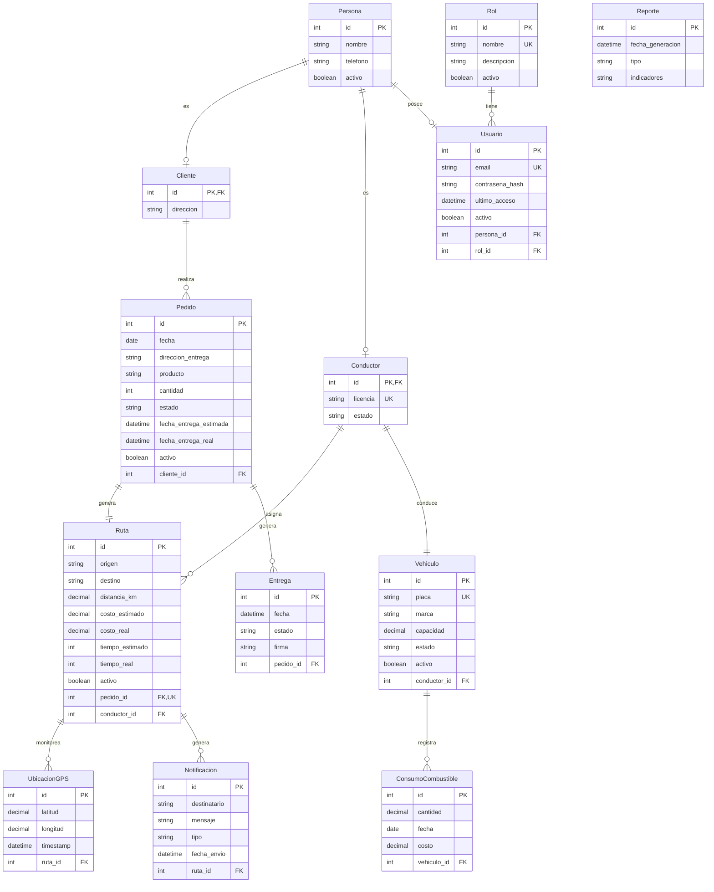

```mermaid
erDiagram
    Persona {
        int id PK
        string nombre
        string telefono
        boolean activo
    }

    Cliente {
        int id PK, FK
        string direccion
    }

    Conductor {
        int id PK, FK
        string licencia UK
        string estado
    }

    Usuario {
        int id PK
        string email UK
        string contrasena_hash
        datetime ultimo_acceso
        boolean activo
        int persona_id FK
        int rol_id FK
    }

    Rol {
        int id PK
        string nombre UK
        string descripcion
        boolean activo
    }

    Pedido {
        int id PK
        date fecha
        string direccion_entrega
        string producto
        int cantidad
        string estado
        datetime fecha_entrega_estimada
        datetime fecha_entrega_real
        boolean activo
        int cliente_id FK
    }

    Vehiculo {
        int id PK
        string placa UK
        string marca
        decimal capacidad
        string estado
        boolean activo
        int conductor_id FK
    }

    Ruta {
        int id PK
        string origen
        string destino
        decimal distancia_km
        decimal costo_estimado
        decimal costo_real
        int tiempo_estimado
        int tiempo_real
        boolean activo
        int pedido_id FK, UK
        int conductor_id FK
    }

    UbicacionGPS {
        int id PK
        decimal latitud
        decimal longitud
        datetime timestamp
        int ruta_id FK
    }

    Entrega {
        int id PK
        datetime fecha
        string estado
        string firma
        int pedido_id FK
    }

    ConsumoCombustible {
        int id PK
        decimal cantidad
        date fecha
        decimal costo
        int vehiculo_id FK
    }

    Notificacion {
        int id PK
        string destinatario
        string mensaje
        string tipo
        datetime fecha_envio
        int ruta_id FK
    }

    Reporte {
        int id PK
        datetime fecha_generacion
        string tipo
        string indicadores
    }

    Persona ||--o| Cliente : es
    Persona ||--o| Conductor : es
    Persona ||--o| Usuario : posee
    Rol ||--o{ Usuario : tiene
    Cliente ||--o{ Pedido : realiza
    Conductor ||--o{ Ruta : asigna
    Conductor ||--|| Vehiculo : conduce
    Vehiculo ||--o{ ConsumoCombustible : registra
    Pedido ||--|| Ruta : genera
    Pedido ||--o{ Entrega : genera
    Ruta ||--o{ UbicacionGPS : monitorea
    Ruta ||--o{ Notificacion : genera
```
